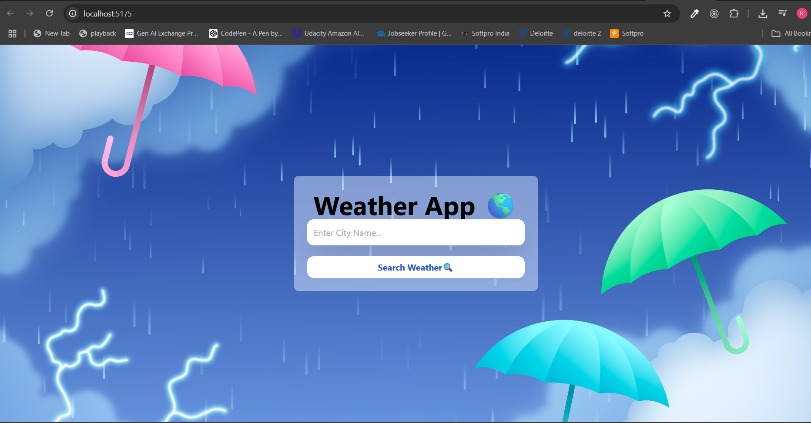

# 🌎 Weather App

A modern, responsive weather application built with **React**, **Vite**, and **Tailwind CSS**, using the **OpenWeather API** to display real-time weather data for any city.

---


## 📹 Demo
[🌐 Watch the demo](https://weather-app-three-beta-12.vercel.app)


---

## ✨ Features
- 🌤 **Search Weather** by entering a city name
- 🌡 Displays **Temperature, Humidity, Wind Speed, and Cloud Cover**
- 📷 Attractive **background image** with smooth styling
- ⏱ **Real-time data** fetched from OpenWeather API
- 📱 Fully **responsive design** for mobile and desktop

---

## 🛠️ Tech Stack
- **Frontend:** React + Vite
- **Styling:** Tailwind CSS
- **API:** OpenWeather API
- **Deployment:** Vercel

---

## 📸 Screenshot
[](public/demo.mp4)

---

## ⚡ Getting Started

Follow these steps to run the project locally:


### 1️⃣ Clone the repository
```bash
git clone https://github.com/your-username/weather-app.git
cd weather-app 
 ```

---


### 2️⃣ Install dependencies
```bash
npm install
```
---


### 3️⃣ Run the development server
```bash
npm run dev
```

Now open your browser and go to http://localhost:5173 to view the app.


📄 License

This project is licensed under the MIT License — feel free to use and modify it.
```bash

This version:  
✅ Has all steps properly formatted.  
✅ Uses clear section titles with emojis.  
✅ Includes **Step 3** to run the app.  
✅ Will look clean and professional on GitHub.  

I can also make it **even more eye-catching** with shields.io badges for React, Vite, Tailwind, and API if you want.

```

